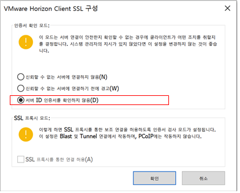
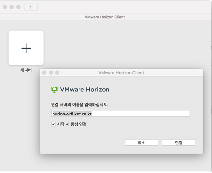
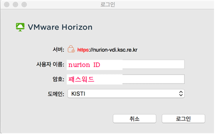
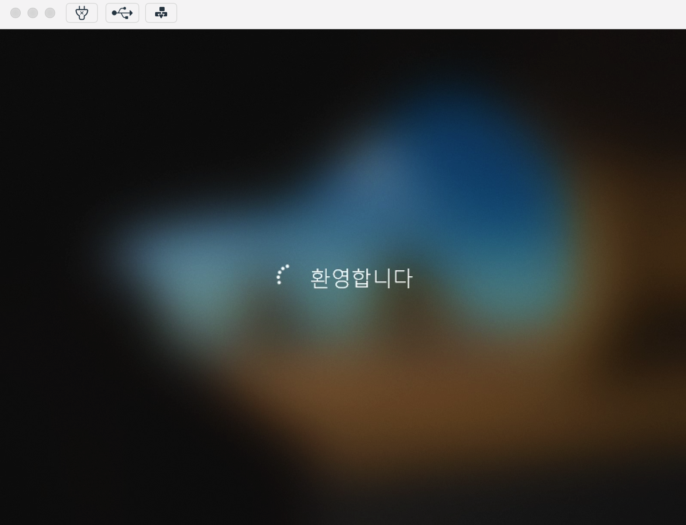
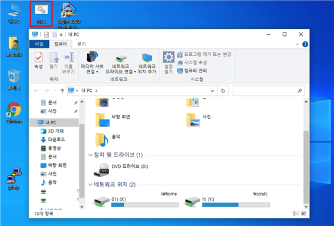

# 데스크톱 가상화(VDI) 사용법

## 가. VDI 서비스 개요

데스트톱 가상화(VDI)는 Windows 환경에서 고성능 그래픽 처리 기능이 필요한 어플리케이션 실행을 위한 원격 데스크톱 서비스다. VDI는 누리온의 파일시스템과 연동되어 별도 파일 이동 없이 가상머신(VM)에서 공학해석 전·후처리가 가능하다. VM에서 해석(solving)은 지원되지 않으며, VM내에서 터미널 접속 프로그램(putty 등)을 통해 누리온 시스템으로 해석을 수행하면 된다.

VM당 3.0Ghz 4코어 CPU, 32GB 메모리, 8GB GPU 메모리가 할당되어 있으며, 총 8개의 VM으로 구성되어 있다. 한정된 VM으로 다수의 사용자 지원을 위해 VM접속 상태에서 2시간 동안 사용하지 않는 경우 자동 로그오프 된다.

현재 공학해석 어플리케이션은 Abaqus 2020, Ansys 2020 R2를 지원하고 있으며, 향후 사용자 요구에 따라 지원 어플리케이션을 확대할 예정이다.

VDI 서비스 이용을 위해 아래 양식을 account@ksc.re.kr로 신청하면 관리자 승인 후 초기 패스워드를 발급한다. 초기 패스워드는 VM 최초 접근 시 변경하여야 하며, 누리온 패스워드와 연동되지 않는다.

사용 중 오류나 의문사항은 KSC 웹사이트(https://www.ksc.re.kr)의 상담신청을 통해 문의한다.

## 나. VDI 서비스 신청

아래와 같이 누리온 시스템 VDI 서비스를 신청합니다.

\- 누리온 ID :

\- 사용기간 :

\- 사용 어플리케이션 :

## 다. VDI 접속 방법

VM 접속을 위해 아래 사이트에서 사용자 환경에 맞는 Horizon Client를 다운받아 설치한다.\
[https://my.vmware.com/en/web/vmware/downloads/info/slug/desktop\_end\_user\_computing/vmware\_horizon\_clients/horizon\_8](https://my.vmware.com/en/web/vmware/downloads/info/slug/desktop\_end\_user\_computing/vmware\_horizon\_clients/horizon\_8)

Horizon Client 설치 후 아래와 같이 설정 한다.

오른쪽 상단 설정메뉴 - SSL구성

서버 ID 인증서를 확인하지 않음 선택 후 확인

새 서버 – 연결 서버 nurion-vdi.ksc.re.kr 입력 후 연결

누리온 ID와 OTP 번호 입력 후 로그인

최초 접근 시 관리자가 발급한 VDI 패스워드를 입력(누리온 시스템의 아이디는 동일하지만 패스워드는 별개임)

VM 접근 시 이미지 초기화 및 사용자 프로파일 생성으로 약 3분 소요

VM 접속이 완료되면 누리온 시스템의 home01과 scratch가 자동으로 마운트 되며 마운트가 되지 않거나 오류가 있을 경우 바탕화면의 NFS를 실행\
보안을 위해 C:\ 드라이브, 제어판 등은 접근이 차단되어 있으며, 2시간 동안 사용하지 않을 경우 자동으로 로그오프 됨


2022년 3월 2일에 마지막으로 업데이트되었습니다.

