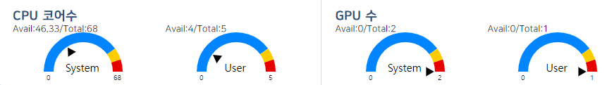
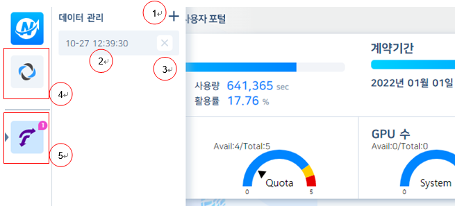

# 국가센터 초고성능컴퓨팅 서비스 포털 개발 사용자 지침서

## 1. 서비스 포탈

### 1.1. 로그인

#### 1.1.1. 로그인

로그인 페이지 [https://my.ksc.re.kr](https://my.ksc.re.kr) 로 이동후 아이디, 비밀번호, OTP 번호 입력, 접속할 서비스를 선택 후 로그인한다.

## **2**. 서비스 포탈

### 2.1. 로그인

#### 2.1.1. 로그인

대시보드는 아래 메인화면과 같은 형태로 구성되며 즐겨찾기, 실행중 메뉴, SRU 정보 및 시스템, 사용자별 CPU, GPU 사용현황, 공지사항, 서비스 메뉴를 제공하며 각 항목에 대한 설명은 아래와 같다.

1\) 메인 화면으로 이동한다.

2\) 즐겨찾기 메뉴

3\) 실행중 메뉴

4\) SRU 관련 정보를 표시한다.\
사용기간을 표시한다.

5\) 메뉴 진행 상태\
\- 메뉴의 실행 상태를 표시한다.\
\- 클릭시 실행화면 패널로 이동한다.

6\) 공지사항을 표시한다.\
\- 타이틀 클릭시 해당 공지 화면으로 링크한다.

7\) 즐겨찾기\
\- 클릭시 즐겨찾기 메뉴 영역에 메뉴가 표시된다.\
\- 추가 상태에서 클릭시 즐겨찾기가 해제된다.

8\) 누리온, 뉴론 서비스로 이동한다.

9\) 설정화면을 표시한다.

10\) 상담안내, 사용법 화면으로 이동한다.

11\) 개인정보 변경 화면으로 이동한다.

12\) 로그아웃

13\) 메뉴 실행 아이콘

14\) System, User별 CPU, GPU 갯수를 표시한다.

<figure><figcaption>
[메인화면]
</figcaption></figure>

&#x20;

#### 1.2.2. 그래프

그래프는 CPU 코어수, GPU 수를 표시하며 표시 내용은 아래와 같다.

\-       Total 대비 사용 가능한 CPU코어/GPU 수를 표시

\-       Total 전체 CPU코어/GPU수

\-       Avail 사용가능한 CPU코어/GPU수

\-       System 전체 시스템 현황

\-       User 사용자 할당 현황

&#x20;

<figure><figcaption>
[시스템 사용현황]
</figcaption></figure>

#### 1.2.3. 서브 메뉴

서브 메뉴는 즐겨찾기로 추가되거나 현재 실행중인 메뉴가 있을 시 좌측에 표시되며 마우스 오버시 각 메뉴에 대한 세부 리스트가 표시되며 세부 내용은 아래와 같다.

1\)  메뉴를 실행한다.

2\) 실행중 메뉴\
\- 메뉴의 정상 실행시 표시된다.\
\- 실행시간이 표시된다.\
\- 클릭시 메뉴 실행화면 패널로 이동한다.

3\) 현재 실행중인 메뉴를 종료한다.

4\) 즐겨찾기 메뉴 영역.\
\- 마우스 오버시 서브 메뉴를 표시한다.\
\- 실행중인 메뉴 존재시 아이콘 좌측에 실행중 아이콘이 표시된다.\
\- 실행중인 메뉴 존재시 실행중인 메뉴 갯수를 아이콘 우측 상단에 표시한다.

5\) 실행중 메뉴 영역.\
\- 마우스 오버시 서브 메뉴를 표시한다.\
\- 실행중인 메뉴 존재시 아이콘 좌측에 실행중 아이콘이 표시된다.\
\- 실행중인 메뉴 존재시 실행중인 메뉴 갯수를 아이콘 우측 상단에 표시한다.

<figure><figcaption>
[서브메뉴]
</figcaption></figure>

&#x20;

#### 1.1.3. 설정

로그아웃시 실행중인 Pod의 종료, 유지 여부를 설정한다.

&#x20;

#### 1.1.4. 메뉴 실행

메뉴의 실행은 크게 2가지 형태로 메뉴를 바로 실행하는 메뉴와 메뉴의 항목 입력후 실행하는 방법이 있다.

\-       Jupyter, RStudio 메뉴는 실행 아이콘(+)를 클릭하면 입력항목이 나타난다.

\-       항목 입력후 확인 버튼을 클릭하여 실행한다.

\-       바로 실행하는 메뉴는 실행 아이콘(+) 클릭후 확인하여 실행한다.

&#x20;

#### 1.1.5. 메뉴 상태

메뉴를 실행하면 각 메뉴를 실행상태에 따라 아래 그림과 같이 상태를 표시하며 실행중 Abnormal 상태가 발생시 상태에 마우스를 오버하면 상태에 대한 정보확인이 가능하다.

1\)     현재 실행중인 메뉴의 상태를 표시한다.\
\- 실행중 Abnormal 발생시 진행 상태를 표시한다.\
\- 마우스 오버시 전체 상태/메세지를 표시한다.

2\)     현재 실행중인 메뉴를 종료한다.

\[메뉴 상태]

&#x20;

### 1.2. 배치작업 

#### 1.2.1. 큐 정보 

&#x20;

가.   프로그램 실행

① 메인 대시보드의 서비스 준비가 완료되면, 배치 작업 위젯의 + 버튼을 클릭하여 프로그램을 구동합니다.

② 탭으로 구성된 화면에서 \[큐 정보]를 클릭하여 이동합니다.

※ 배치 작업을 실행시 서비스 준비가 완료되면 다음과 같은 화면으로 변경됩니다.

   

&#x20;

&#x20;

나.   화면 구성

\- Nurion 서버의 큐의 Nodes(Free, Alloc, Down), Jobs(Run,Queued), Lagest Job 자원정보를 확인할 수 있다.

※  기능 구성

1\. Refresh : 최신 정보로 업데이트 한다.

2\. Filtering : 큐 상태 목록의 행을 클릭 한다. 큐 구성 상태가 필터링 된다.

3\. Filtering Clear : 필터링 상태를 취소한다.

&#x20;

&#x20;

#### 1.2.2. JOB 정보

&#x20;

가.   프로그램 실행

① 배치잡 프로그램 탭에서 \[Job정보]를 클릭하여 이동합니다.

&#x20;

&#x20;

&#x20;

나. 화면 구성

\-  Nurion 서버의 실행중인 Job 목록을 확인할 수 있으며,  \[Your Jobs , All Jobs] 로 실행중인 목록을 필터링 할 수 있다. Your Jobs에서 사용자가 실행한 프로그램에 한해서 실행을 취소할 수 있다.

※  기능 구성

1\.     Filtering : \[Your Jobs , All Jobs]으로 데이터를 필터링 할 수 있다.

2\.     Refresh : 서버에 동작하는 Job의 정보를 갱신 합니다.

3\.     Cancel : Your Jobs에서 실행중인 프로그램에 대해서 취소할 수 있다. 다중 선택을 지원한다.

4\.     키워드 검색 지원 : 모든 필드에 대한 키워드로 필터링 할 수 있다.

5\.     스크립트 내용보기 : JobId 컬럼을 클릭하면 실행중인 스크립트 내용을 확인 할 수 있다.

&#x20;

&#x20;

\

&#x20;

#### 1.2.3. JOB 생성

가. 프로그램 실행

① 배치잡 프로그램 탭에서 \[JOB생성]을 클릭하여 이동합니다.

※  누리온 스크립트 구성

\- 작업이름 : 사용자 입력 작업 이름

\- 큐 : 시스템에서 제공하는 큐를 콤보박스에서 선택

\- 사용자 프로그램 정보 : 시스템에서 제공하는 사용자 프로그램 정보를 콤보박스에서 선택

\- 노드수 : 노드 수를 입력한다

\- 프로세스당 CPU 코어 수 : 프로세스당 CPU 코어 수를 입력한다

\- 노드당 프로세스 수 : 노드당 프로세스 수를 입력한다

\- OMP 스레드 수 : 스레드 수를 입력한다.

\- 작업 실행 시간 : hh:mm:ss 형식으로 작업 실행 시간을 입력한다.

\- 표준 출력 및 입력파일 합치기 : Enable/Disable을 선택한다

\- 작업 실행 중 표준 출력/표준 에러 파일 확인 : Enable/Disable을 선택한다

\- 작업 이메일 알림 옵션 : 이메일 알림 옵션을 선택한다

\- 작업 이메일 알림 주소 : 이메일 알림을 받을 주소를 입력한다. 이메일 알림 옵션에서 “알림 없음”을 선택하면 입력하지 않아도 된다.

&#x20;

※  기술지원 > 지침서 > 사용법 > 누리온 > 스케줄러(PBS)를 통한 작업 실행 문서를 참조

&#x20;

&#x20;

※  기능 구성

1\. 파일 트리 : 할당된 계정의 파일 목록이 출력된다.

2\. 기능 버튼 :

New Job : Nurion에서 지원하는 Job 스크립트를 신규로 파일을 생성하는 작업을 시작한다.

New File : 일반 스크립트 파일을 생성할 수 있도록 Edit 화면으로 이동한다

New Directory : 파일트리에서 선택한곳에서 신규 디렉토리를 생성한다

Upload : 선택한 파일을 업로드한다. 파일 다중 선택을 지원한다.

Download: 파일 트리에서 선택된 자료를 다운로드한다. 파일은 단독으로 다운로드 하며, 폴더는 Zip파일형식으로 압축하여 다운로드 수행한다.

Delete : 파일 트리에서 선택한 파일 또는 디렉토리를 삭제한다.

&#x20;

3\. 스크립트 입력폼 :

\- 폼의 선택 값에 따라 파라미터 자동 입력 영역에 자동으로 생성됩니다.

4: 스크립트 :

\-       파라미터 자동 입력 영역 : 사용자가 편집할 수 없으며 파라미터 입력란에서 입력한 값이 자동으로 반영된다

\-       사용자 스크립트 영역 : 파라미터 이외의 값을 사용자가 자유롭게 입력할 수 있다

&#x20;

5: 파일 정보

\-       현재 디렉토리 : 현재 선택한 디렉토리를 표시한다

\-       작업 스크립트 파일명 : 현재 선택한 Job 파일 이름을 표시한다

&#x20;

6\. 파일 저장 및 제출

\- Save : Job 파일을 저장한다

\- SaveAs : Job 파일을 다른 이름으로 저장하기 위해 입력창을 표시한다

\- Submit : 현재 선택한 Job 파일을 제출한다.

※  Job을 제출을 위해서 파일을 저장해야 한다.

&#x20;

&#x20;

&#x20;

&#x20;

### 1.3. 모바일

#### 1.3.1. 로그인 

&#x20;

아이디, 비밀번호, OTP 번호 입력, 접속할 서비스(Nurion)를 선택 후 로그인한다.

&#x20;

&#x20;

&#x20;

&#x20;

&#x20;

&#x20;

&#x20;

#### 1.3.2. 대시보드

1\.     이용중인 서비스 내역 표기 : SRU Time, 제공량, 잔여량, 사용량, 활용률, 계약기간 정보를 제공한다.

2\.     시스템 공지/정기점검 공지사항 : 최근 공지사항에 표기 된다.

3\.     My Job, 큐정보 영역 : My Job에서 현재 동작 프로그램 확인 하며,  취소기능을 지원한다.  큐정보는 Free, Alloc, Down 자원 사용량을 확인 가능하다.

&#x20;

&#x20;

#### 1.3.3. Job 정보

1\.     Job 정보 : My Job탭에서 Job Id 항목을 선택하면 스크립트 내용을 표기할 수 있다.

&#x20;

※    Push Message : Batch Job 종료되어있으면 Job의 완료 메세지를 받을 수 없습니다.

&#x20;

&#x20;

&#x20;

&#x20;

&#x20;

&#x20;

#### 1.3.4. 큐 정보

큐 정보 : 큐 정보를 탭을 선택하면 접속한 시스템의 큐 정보를 보여준다

&#x20;
